# AUDIT (Automated Detection of Unsafe and Illicit Training)

### 1. Intro

Hugging Face hosts 2.5M+ models, yet security infrastructure only detects malicious code, not malicious weights. AUDIT closes this gap by detecting models that have been covertly fine-tuned to remove safety alignment or insert backdoors.

```mermaid
graph TD;
    %% Define Nodes
    A([Hugging Face Repo]) --> B{<b>Layer 1: Static</b>}
    
    subgraph "Weight-Diff Triage"
    B --> C[ΔW SVD & Spectral Features]
    C --> D[Risk Classifier]
    end

    D --> E{Harmful?}
    
    E -- No --> F([BENIGN])
    E -- Yes --> G{<b>Layer 2: Dynamic</b>}

    subgraph "Adversarial Stress-Test"
    G --> H[Red-Teaming & Inference]
    H --> I[Llama Guard 3 Eval]
    end

    I --> J([Safety Report])

    %% Styling for a compact look
    style A fill:#f9f,stroke:#333
    style F fill:#d4edda,stroke:#28a745
    style J fill:#f8d7da,stroke:#dc3545
    style B fill:#e1f5fe,stroke:#01579b
    style G fill:#fff3e0,stroke:#e65100
```

**AUDIT System Architecture**. Our detection pipeline combines static weight analysis with adversarial auditing for validation. This approach enables the screening of millions of open-source models for malicious fine-tuning or backdoors.

---

### 2. Technical Architecture

**Layer 1: Static Weight-Diffing** 

*  We compute the weigth delta between a candidate model and its known-safe base. 

* We extract ~60 aggregate features, including **low-rank SVD** on attention projection and MLP matrices to identify structural anomalies. 

* This layer enables rapid triage at repository scale without the cost of running inference. 

**Layer 2: Adversarial Auditing** 

* If Layer 1 flags a model as suspicious, we trigger an automated red-teaming session. 

* We subject the model to adversarial prompts from **HarmBench** and **StrongREJECT**. 

* Eesponses are classified by **Llama Guard** across the 13 MLCommons hazard categories. 

---

### 3. Key Achievements 

* Successfully identified 3/3 safety-compromised/jailbroken models (Gemma and Qwen variants) with zero false positives on benign controls. 

* Our static weight analysis predicted safety degradation with up to **68.6% confidence** before a single prompt was even sent. 

*  Automated a pipeline that identified unsafe response rates as high as **43.3%** in "uncensored" fine-tunes. 

Read the [full report](https://apartresearch.com/project/audit-7hmj) here on Apart Research's website. 
